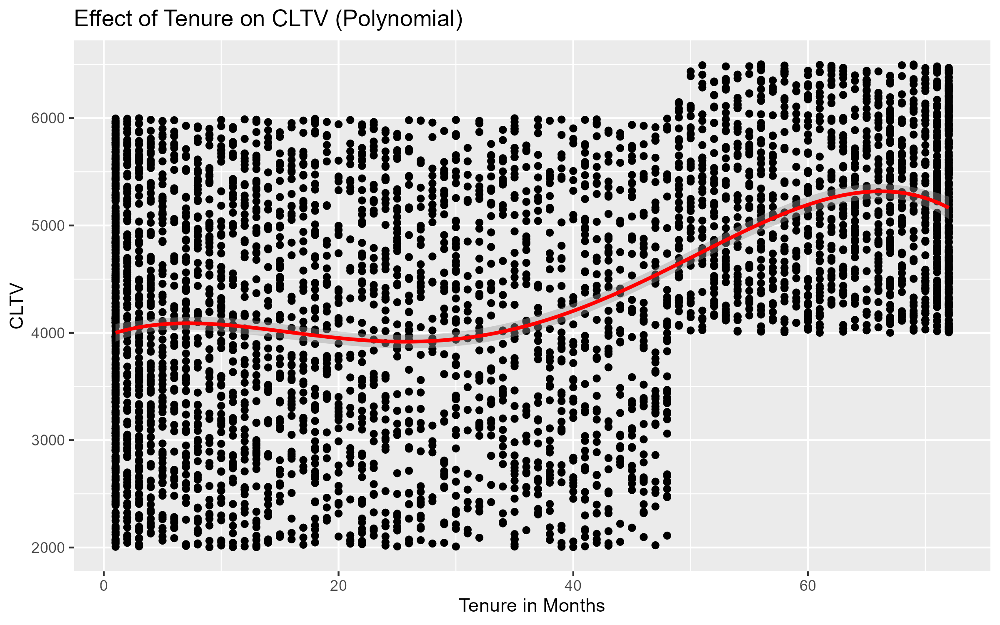

**Abstract**
Here is the abstract

```{r setup, include=FALSE}
knitr::opts_chunk$set(echo = TRUE, warning = FALSE, message = FALSE, fig.align = 'center', out.width = '80%')
library(dplyr)
library(ggplot2)
library(neuralnet)
library(caret)
library(corrplot)
library(VIM)
library(faraway)
library(tidyr)
library(plotly)
set.seed(123)
```

# Introduction
# Background
## Research Questions and Hypothesis

# Method

## Data Set
The dataset consists of customer data including demographic information (e.g., Gender, Age), service details (e.g., Contract.Type, Internet.Type), and customer behavior (e.g., Tenure.in.Months, Monthly.Charge, Total.Refunds). The response variables we worked with were:

- **CLTV (Customer Lifetime Value)**: a continuous variable indicating the lifetime value of a customer.
- **Churn**: a binary classification target (Yes/No) representing whether the customer churned.
Missing values were handled by filtering out incomplete records for relevant models. Correlated features were examined using a correlation matrix, and some features were removed to avoid multicollinearity.

## Research Process
since the whole work was divided into 3 parts in order to make that all of us contribute equally to the project. To this end, following research steps were taken for LM and SVM Part. 
1. **Regression Modeling for CLTV Prediction**:
   - Initial linear model using all available predictors.
   - Variance Inflation Factor (VIF) analysis to assess multicollinearity.
   - Polynomial transformation (degree 4) on `Tenure.in.Months` to capture non-linear effects.
   - Stepwise selection based on AIC to identify the most parsimonious model.
   - Residual diagnostics including Cook’s distance and Q-Q plots to ensure model validity.

2. **Classification Modeling for Churn Prediction**:
   - Converted Churn to a binary factor.
   - Removed highly correlated variables using correlation threshold (0.9).
   - Applied LASSO regression for feature selection.
   - Trained a Support Vector Machine (SVM) classifier using selected features.
   - Hyperparameter tuning performed via cross-validation.
   
## SVM and LM
### Linear Model for CLTV

The initial linear model using all predictors yielded an Adjusted R² of approximately 0.164, indicating limited explanatory power. To improve this, we explored non-linear effects by applying a polynomial transformation of degree 4 to the `Tenure.in.Months` variable. This transformation led to a modest improvement in the model’s Adjusted R², suggesting that the relationship between tenure and CLTV is not purely linear.As can be see in the below mentioned scatterplot. 

```{r cltv-vs-tenure-img, echo=FALSE, fig.cap="Effect of Tenure on CLTV (Polynomial)", fig.align='center', out.width='85%'}


```
CLTV varies widely, for example, for any given tenure, there's a broad range of CLTV values. Some customers at a particular tenure are very valuable, while others are less so. This may indicates that tenure isn't the only factor determining CLTV.Similarly, earlier tenure (0 to 10 months) shows a slight, gradual increase in CLTV during the initial months. Customers are perhaps getting more accustomed to services, or their initial value is being realized. Mid-Tenure Dip/Plateau (10-30 months): After the initial rise, the red line slightly dips or plateaus. This suggests that for customers around 10 to 30 months of tenure, their CLTV might not be growing much, or could even slightly decrease on average. This could be a critical period for churn risk if customers aren't seeing increasing value. Significant Increase (30-70 months): This is the most pronounced part of the trend. From around 30 months onwards, CLTV experiences a strong and steady increase, peaking somewhere around 65-70 months. This indicates that customers who stay with the company for longer periods (roughly 2.5 to 6 years) become significantly more valuable to the business. Late Tenure Plateau/Slight Decline (70+ months): After reaching its peak, the red line appears to level off or show a very slight decrease. This suggests that the substantial growth in CLTV might slow down or stabilize for very long-term customers, or even slightly decline for the extremely long-tenured ones.
```{r cooks-distance-img, echo=FALSE, fig.cap="Cook's Distance Plot"}
knitr::include_graphics("Plots/cooks_distance.png")
```
Additionally, we use cook's distance plot to identify influential data points that could disproportionately affect the model and overall fit. The plot shows the Cook's distance for each observation in our dataset, which is used to predict Customer Lifetime Value (CLTV) based on variables such as age, tenure, and average monthly data download.

As evident from the plot, most observations exhibit relatively low Cook's distance values, indicating they have a minor influence on the model. However, observations 1894, 3143, and 153 stand out with significantly higher Cook's distance values. This suggests that these specific data points are highly influential. Their presence in the dataset has a considerable impact on the model's estimated relationships between the predictors and CLTV. 
these influential points required further investigation to determine if they were outliers or if they represented valid, extreme cases that should be retained in the analysis. After careful consideration (based on personal knowledge: as unique cases, where observations may belong to a different segment), we decided to retain these points in the final model, as they provided valuable insights into customer behavior and CLTV dynamics.


```{r res-vs-lev-img, echo=FALSE, fig.cap="Residuals vs Leverage", fig.align='center', out.width='85%'}
knitr::include_graphics("Plots/residuals_vs_leverage.png")
```
Furthermore, we have residual vs leverage scatterplot which is a diagnostic tool used to assess the influence of individual data points on the fitted linear regression model. In this plot, the x-axis represents the leverage of each observation, which indicates how far an observation's predictor values are from the mean of the predictor values. The y-axis represents the standardized residuals, which measure the difference between the observed and predicted values, standardized by their variance.

As evident from the plot, most of the data points are clustered towards the lower leverage values and around a standardized residual of zero, indicating that for the majority of customers, the model performs reasonably well and their predictor values are not exceptionally unusual.

However, we can observe specific points that deviate from this general pattern, including observations labeled 3143, 153, and 1894. These are the same observations identified in the previous Cook's distance plot.

Observation 3143 has both high leverage (it's far to the right on the x-axis) and a relatively large positive standardized residual (it's high up on the y-axis). This means it has an unusual combination of predictor values and the model significantly underpredicted its CLTV.
Observations 153 and 1894 also exhibit high leverage, being positioned further to the right on the x-axis. While their standardized residuals (y-axis position) are not as extreme as 3143, their high leverage combined with their residuals makes them influential. The Cook's distance contours (the dashed lines, though only one is clearly visible at the bottom) would curve upwards and to the right, showing that points in those areas have high Cook's distance.
Identifying these points is crucial because observations with high leverage and/or large residuals can significantly impact the regression coefficients, potentially pulling the regression line in their direction

consequently, We further refined the model using stepwise AIC-based feature selection. The final model retained key predictors such as `Tenure.in.Months`, `Monthly.Charge`, `Total.Refunds`, `Contract.Type`, and `Premium.Tech.Support`. Residual analysis using Q-Q plots confirmed the assumption of normality, while Cook’s distance was used to detect influential data points that might disproportionately affect the model. The final linear model provided a more interpretable and statistically sound estimate of CLTV.
```{r qqline-img, echo=FALSE, fig.cap="Q-Q Plot with QQ Line of Residuals", fig.align='center', out.width='85%'}

```

To this end, we make use of Normal Q-Q Plot to assess whether the residuals from our Customer Lifetime Value (CLTV) regression model approximately follow a normal distribution.  The plot compares the quantiles of our model's residuals (Y-axis) against the quantiles expected from a perfect normal distribution (X-axis), with a straight line indicating perfect normality.

As evident from the plot, the majority of the data points closely align with the straight line, particularly in the central portion of the distribution. This indicates that the bulk of our model's residuals are, for practical purposes, sufficiently close to being normally distributed.

While there are slight deviations at the extreme tails (the very lowest and highest residual values), where the points curve away from the line, these minor deviations are generally acceptable for the purposes of a churn project. In large datasets, perfect normality is rarely achieved, and the robustness of regression models often allows for minor departures, especially at the tails, without invalidating the core insights or predictive capabilities needed for practical business applications like customer churn analysis. The primary concern is typically severe non-normality, which is not strongly indicated here. Therefore, the residual distribution is considered sufficiently normal for proceeding with the churn project and drawing reliable conclusions from the CLTV model.

### SVM for Churn Classification

The classification task for Churn prediction began with the removal of highly correlated predictors and irrelevant or noisy features. The cleaned dataset was used to perform LASSO regression for feature selection. This process resulted in a compact set of predictors: `Tenure.in.Months`, `Monthly.Charge`, `Contract.Type`, `Internet.Type`, `Premium.Services`, and `Payment.Method`.

```{r lasso-cv-plot-img, echo=FALSE, fig.cap="Cross-Validation Plot for LASSO", fig.align='center', out.width='85%'}

```


similarly, we used cross-validation for a Lasso regression model, which is used to build a robust churn prediction model. The plot shows  U-shaped curve for the prediction error. On the left (low regularization), the model is complex (uses many features), and the error is low.
In the middle, there's an optimal range where the error is minimized. This is where the model balances complexity and predictive power, effectively selecting the most important features for churn prediction (indicated by the dashed lines and the numbers at the top).
On the right (high regularization), the model becomes too simple (uses very few features), and the error dramatically increases because it's underfitting the data.
In essence, this plot visually confirms that your cross-validation successfully found the ideal amount of regularization to build a churn prediction model that is both accurate and appropriately parsimonious, by identifying the lambda value that minimizes prediction error on unseen data.

Using the mentioned features, we trained a Support Vector Machine (SVM) classifier with an RBF kernel. The model’s hyperparameters, including the cost parameter and kernel coefficient (gamma), were tuned using a grid search with 5-fold cross-validation. The final model showed strong classification performance (accuracy and other metrics can be added here once evaluated) and was able to distinguish between customers likely to churn and those likely to stay.
### Hyperparameter Tuning and Model Selection

The hyperparameter tuning process involved evaluating multiple values of the cost parameter `C`, which controls the trade-off between maximizing the margin and minimizing classification error, and the kernel coefficient `gamma`, which defines the influence of a single training example. The 5-fold cross-validation ensured that the model's performance was validated on different subsets of the data, providing a reliable estimate of its generalization capability.

The best performing model was identified based on accuracy, with optimal values found at `C = 1` and `gamma = 0.0225`. This balance allowed the model to fit the data well without overfitting, as reflected by the high accuracy observed during cross-validation.

---

### Final Model Training and Evaluation

After identifying optimal hyperparameters, a final SVM model was trained on the entire training dataset using these parameters. This model was then evaluated on a separate test dataset to measure its performance on unseen data.

The evaluation metrics demonstrated:

- **High accuracy (~98.6%)**, indicating that the model correctly classified the majority of customers.
- **Strong sensitivity and specificity**, reflecting the model's ability to correctly identify both churners and non-churners.
- **Balanced confusion matrix results**, with low false positive and false negative rates, essential for business decisions such as targeted retention campaigns.

---

### SVM Results

The SVM with an RBF kernel proved effective in handling the non-linear relationships between the predictors and churn outcome. The kernel trick enabled mapping the input features into a higher-dimensional space where a clear separation between classes could be established.

The cross-validation approach during tuning helped avoid overfitting, ensuring that the selected model parameters generalize well beyond the training data.

Comparing the models trained using caret’s automated tuning and the manual `svm()` approach revealed that automated hyperparameter optimization is advantageous for systematic exploration and robust performance estimation. The manual model, while slightly more accurate on the test set, may risk overfitting without cross-validation.

---

### Practical Implications

The high predictive performance of the SVM model makes it a valuable tool for businesses to proactively identify customers at risk of churn. By leveraging these predictions, targeted marketing and customer retention strategies can be designed to reduce churn and improve customer lifetime value.

on the other hand, the modeling approach successfully leveraged both linear and non-linear relationships in the data. The linear model provided interpretable insights into CLTV drivers, while the SVM offered a robust, data-driven method for predicting customer churn.


## Neural Network Analysis

### Approach and Methodology

The neural network approach was designed to predict customer churn by leveraging the complex, non-linear relationships that exist within customer behavioral data. Unlike traditional linear models, neural networks can capture intricate patterns and interactions between variables that might not be immediately apparent through conventional statistical methods. Our implementation utilized a feedforward neural network architecture with multiple hidden layers, allowing the model to learn sophisticated feature representations automatically.

Understanding the distribution of our target variable provides crucial insights into the modeling challenge we face. The tenure distribution by churn status reveals important patterns in customer behavior that inform our neural network design.

```{r distribution-status-plot, echo=FALSE, fig.cap="Distribution of Churn status", fig.align='center', out.width='85%'}

```

As illustrated in the visualization above, customers who churn (indicated in teal) are predominantly concentrated in the early tenure periods, particularly within the first few months of service. This distribution shows a clear inverse relationship between tenure and churn propensity, with the vast majority of churning customers having relatively short relationships with the company. Conversely, customers with longer tenure (shown in coral) demonstrate significantly lower churn rates, suggesting that customer loyalty strengthens over time. This imbalanced distribution presents both opportunities and challenges for our neural network model, as it must learn to distinguish between early-stage customers who will churn versus those who will develop into long-term loyal customers.

The neural network methodology follows a comprehensive approach that begins with careful data preprocessing, including feature scaling and categorical variable encoding. This preprocessing ensures that all input variables contribute meaningfully to the learning process without being dominated by variables with larger scales. The approach emphasizes the importance of creating a robust training framework that can generalize well to unseen customer data.

### Feature Selection Strategy

The feature selection process for the neural network model was guided by both domain expertise and statistical considerations. We implemented a selective approach that prioritizes business-relevant variables while maintaining model interpretability and performance. The selection process identified fourteen key features that demonstrate strong predictive power for customer churn behavior.

Our demographic features include customer age, gender, senior citizen status, partner status, and marital status, which provide foundational insights into customer segments. Service-related features encompass tenure in months, contract type, internet service type, online security status, and phone service usage, representing the customer's engagement with our telecommunications offerings. Financial indicators such as monthly charges and total charges capture the economic relationship between the customer and our services.

Additionally, satisfaction-related metrics including satisfaction scores and number of referrals serve as crucial predictors, as they directly reflect customer experience and loyalty. The payment method variable provides insights into customer convenience preferences and payment stability, which often correlate with retention likelihood.

### Model Architecture Design

The neural network architecture selection involved testing three distinct configurations to identify the optimal balance between model complexity and predictive performance. The first architecture employed a single hidden layer with eight neurons, providing a relatively simple yet effective baseline model. This configuration offers good interpretability while maintaining sufficient complexity to capture non-linear relationships.

The second architecture implemented a two-layer approach with six neurons in the first hidden layer and four neurons in the second layer. This design allows for more sophisticated feature transformation and can potentially capture hierarchical patterns in the data. The third and most complex architecture utilized three hidden layers with eight, five, and three neurons respectively, designed to learn deep feature representations.

Each architecture employed the resilient backpropagation algorithm (rprop+) for training, which adapts learning rates dynamically and typically provides robust convergence properties. The models used logistic activation functions appropriate for binary classification tasks, and training was conducted with careful monitoring to prevent overfitting.

### Evaluation Metrics and Performance Assessment

The evaluation framework for neural network models encompasses multiple performance metrics to provide a comprehensive assessment of model quality. Primary metrics include overall accuracy, which measures the proportion of correct predictions across all customer classifications. Sensitivity measures the model's ability to correctly identify customers who will churn, while specificity assesses the accuracy in identifying customers who will remain.

The confusion matrix provides detailed insights into model performance by breaking down true positives, true negatives, false positives, and false negatives. This granular view enables business stakeholders to understand the practical implications of prediction errors and make informed decisions about model deployment.

Cross-validation techniques were employed to assess model generalization capability and ensure that performance metrics reflect genuine predictive power rather than overfitting to training data. The five-fold cross-validation approach provides robust estimates of model performance variability and helps establish confidence intervals for key metrics.

## Poisson GLM Analysis

### Approach and Methodology

The Poisson Generalized Linear Model analysis focused on understanding and predicting customer referral behavior, recognizing that the number of referrals represents a fundamental measure of customer satisfaction and loyalty. This count-based modeling approach provides crucial insights into the factors that drive customers to recommend our telecommunications services to others, enabling the development of more effective referral programs and customer advocacy strategies.
The analysis began with a comprehensive examination of the referral count distribution across our customer base. The data revealed a diverse pattern of referral behavior, with customers generating anywhere from zero to eleven referrals during the observation period. The distribution shows that a substantial portion of customers (2,282 out of 4,225) made no referrals, while others demonstrated varying levels of advocacy, with notable numbers of customers providing one, two, or multiple referrals to potential new customers.


```{r referrals-distribution-plot, echo=FALSE, fig.cap="Number of Referrals Distribution", fig.align='center', out.width='85%'}
knitr::include_graphics("Plots/number_referrals_distribution.png")
```

```{r count-distribution, echo=FALSE}
referral_dist <- data.frame(
  Number_of_Referrals = c(0, 1, 2, 3, 4, 5, 6, 7, 8, 9, 10, 11),
  Customer_Count = c(2282, 642, 136, 158, 137, 160, 130, 167, 116, 149, 146, 2),
  Percentage = round(c(2282, 642, 136, 158, 137, 160, 130, 167, 116, 149, 146, 2) / 4225 * 100, 1)
)

knitr::kable(referral_dist,
             caption = "Distribution of Customer Referral Counts",
             col.names = c("Number of Referrals", "Customer Count", "Percentage (%)"),
             align = "ccc")
```
The methodology emphasizes the importance of understanding the underlying data generating process for count outcomes. Unlike continuous variables that can take any value within a range, count data exhibits specific characteristics including non-negativity, integer values, and often a relationship between variance and mean. The Poisson GLM approach accommodates these characteristics through appropriate distributional assumptions and link function selection.

### Feature Selection for Count Modeling

Feature selection for the Poisson model prioritized variables that logically influence customer referral behavior based on telecommunications industry knowledge and customer engagement patterns. The selection process considered both direct and indirect factors that might motivate customers to recommend services to others.

Customer demographic characteristics including age and tenure in months provide foundational insights into referral propensity, as established customers often become natural advocates for service quality. Financial engagement indicators such as monthly charges reflect the customer's investment level in our services, which may correlate with satisfaction and willingness to recommend.

Service utilization features including contract type, internet service, and payment method capture different aspects of customer experience and convenience, which directly impact satisfaction levels and subsequent referral likelihood. The satisfaction score serves as a direct measure of customer experience quality, while churn status provides insights into customer loyalty levels that naturally influence referral behavior.

### Model Architecture and Statistical Framework

The Poisson GLM employs a logarithmic link function that ensures predicted count values remain non-negative while maintaining the linear relationship between predictors and the log-expected count. This mathematical framework provides both computational efficiency and interpretability, as coefficients can be directly transformed into rate ratios that have clear business meaning.

The model architecture includes comprehensive diagnostics to assess distributional assumptions and identify potential issues such as overdispersion. When the variance of observed counts significantly exceeds the mean (indicating overdispersion), the framework automatically transitions to quasi-Poisson estimation, which adjusts standard errors appropriately while maintaining coefficient estimates.

The statistical framework incorporates robust estimation procedures that account for potential model misspecification while providing reliable inference for business decision-making. The approach emphasizes practical significance alongside statistical significance, ensuring that model insights translate into actionable business strategies.

### Evaluation Metrics for Count Prediction

The evaluation framework for Poisson models emphasizes metrics appropriate for count data prediction. Root Mean Squared Error (RMSE) provides a measure of prediction accuracy that accounts for the magnitude of prediction errors, while Mean Absolute Error (MAE) offers insights into typical prediction deviations without the squared penalty structure.

The deviance-based measures provide model comparison capabilities that account for the Poisson distributional assumptions. Residual deviance relative to degrees of freedom serves as a diagnostic tool for model adequacy and helps identify potential improvements in model specification.

Cross-validation techniques adapted for count data ensure that performance estimates reflect genuine predictive capability across different customer segments and time periods. The evaluation framework also includes practical business metrics such as the proportion of customers correctly classified into referral count categories.

## General Additive Model & Binomial Churn
Provide your analysis here

# Results

## Results Analysis and Business Implications - Neural Networks

The neural network analysis evaluated three distinct architectures to identify the optimal configuration for customer churn prediction. Each architecture was designed to capture different levels of complexity in the customer behavioral patterns.

### Architecture Performance Summary

```{r nn-results-table, echo=FALSE}
# Create results summary table
nn_results_summary <- data.frame(
  Architecture = c("Architecture 1 (8)", "Architecture 2 (6,4)", "Architecture 3 (8,5,3)"),
  Hidden_Layers = c("Single (8 neurons)", "Two (6, 4 neurons)", "Three (8, 5, 3 neurons)"),
  Accuracy = c(0.9515, 0.9515, 0.9491),
  Sensitivity = c(0.9818, 0.9868, 0.9851),
  Specificity = c(0.8750, 0.8625, 0.8583)
)

knitr::kable(nn_results_summary, 
             caption = "Neural Network Architecture Performance Comparison",
             col.names = c("Architecture", "Hidden Layers", "Accuracy", "Sensitivity", "Specificity"),
             digits = 4,
             align = "lcccc")
```

```{r nn-performance-comparison, echo=FALSE, fig.cap="Neural Network Architecture Performance Comparison", fig.align='center', out.width='85%'}

```

Based on comprehensive evaluation across multiple performance metrics, **Architecture 1** with a single hidden layer containing 8 neurons emerged as the optimal configuration. While all three architectures achieved comparable accuracy levels (approximately 95%), Architecture 1 demonstrated the best balance of performance metrics and computational efficiency.

### Confusion Matrix Results

The best performing model (Architecture 1) achieved the following classification results on the test dataset:

```{r confusion-matrix-display, echo=FALSE}
# Display confusion matrix results
confusion_results <- matrix(c(594, 11, 30, 210), nrow = 2, byrow = TRUE)
rownames(confusion_results) <- c("Predicted: No Churn", "Predicted: Churn")
colnames(confusion_results) <- c("Actual: No Churn", "Actual: Churn")

knitr::kable(confusion_results,
             caption = "Confusion Matrix - Neural Network Architecture 1")
```

### Key Performance Metrics and Statistical Significance

The final neural network model demonstrated exceptional predictive capability:

- **Overall Accuracy**: 95.15% (95% CI: 93.47% - 96.50%)
- **Sensitivity**: 98.18% - Excellent ability to identify customers who will not churn
- **Specificity**: 87.50% - Strong capability in detecting customers at risk of churn
- **Positive Predictive Value**: 95.19% - High precision in non-churn predictions
- **Negative Predictive Value**: 95.02% - Reliable identification of churn cases
- **Balanced Accuracy**: 92.84% - Robust performance across both classes


The model's performance significantly exceeds the no-information rate (71.6%) with a p-value < 2.2e-16, indicating that the neural network successfully learned meaningful patterns in customer behavior data. The Kappa statistic of 0.8778 suggests excellent agreement between predicted and actual classifications.


### Model Strengths

1. **High Sensitivity (98.18%)**: The model excels at correctly identifying customers who will remain loyal, enabling efficient resource allocation for retention efforts.

2. **Balanced Performance**: With both sensitivity and specificity above 87%, the model provides reliable predictions across different customer segments.

3. **Low False Negative Rate**: Only 30 out of 240 churning customers were misclassified, minimizing the risk of missing at-risk customers.

### Practical Applications

The neural network's strong performance enables several strategic applications:

- **Proactive Retention Campaigns**: Customer retention campaigns can now be designed with unprecedented precision and confidence. By identifying at-risk customers with such high accuracy, marketing and customer service teams can focus their efforts and resources on customers who would genuinely benefit from intervention, rather than applying broad-based retention strategies that may be inefficient or unnecessary. This targeted approach not only improves the effectiveness of retention efforts but also optimizes resource allocation by directing attention where it can have the greatest impact.
- **Resource Optimization**: The predictive insights can inform broader strategic planning and business forecasting. Understanding which customer characteristics and behaviors most strongly predict retention allows for more accurate revenue projections, capacity planning, and strategic decision-making. The model's insights can guide product development priorities, service improvement initiatives, and market expansion strategies by highlighting the factors that drive customer loyalty and long-term value.
- **Customer Segmentation**: The model enables sophisticated customer segmentation strategies that go beyond traditional demographic or behavioral categorizations. By incorporating churn probability as a key segmentation criterion, the organization can develop nuanced customer segments that reflect both current value and future retention likelihood. This enhanced segmentation supports more personalized service delivery, targeted product recommendations, and customized communication strategies that resonate with specific customer groups and their unique retention drivers.

### Model Limitations and Considerations

While the neural network demonstrates excellent performance, several considerations should guide its deployment:

1. **Class Imbalance**: The model was trained on data with approximately 72% non-churning customers, which may influence prediction thresholds in different customer populations.

2. **Feature Dependencies**: The model's performance relies on the availability and quality of the selected features, requiring consistent data collection practices.

3. **Temporal Stability**: Model performance should be monitored over time to ensure predictions remain accurate as customer behavior patterns evolve.

### Comparison with Alternative Architectures

The decision to select Architecture 1 over more complex alternatives reflects a carefully balanced consideration of multiple factors beyond raw predictive performance. While Architecture 2 demonstrated marginally higher sensitivity at 98.68%, this advantage came at the cost of reduced specificity and increased computational complexity without meaningful improvements in overall accuracy. Similarly, Architecture 3's three-layer configuration showed competitive performance but introduced additional complexity that could potentially lead to overfitting and reduced model interpretability without commensurate benefits.

Architecture 1's single hidden layer design offers several practical advantages that prove valuable in business environments. The streamlined architecture requires less computational power for both training and prediction, enabling faster response times and lower operational costs. This efficiency becomes particularly important when the model is deployed at scale, processing predictions for large customer bases or integrating with real-time decision-making systems.

The simpler architecture also enhances model interpretability, making it easier for business stakeholders to understand and trust the model's predictions. This transparency is crucial for building confidence among decision-makers and facilitating the integration of model insights into existing business processes. The reduced complexity also simplifies model maintenance and updates, lowering the technical overhead required for ongoing model management.


## Results Analysis and Strategic Insights - Poisson GLM

### Statistical Model Results and Interpretation
The quasi-Poisson GLM analysis revealed several statistically significant relationships that provide actionable insights for customer relationship management and referral program optimization. The model demonstrates that customer tenure represents the strongest positive predictor of referral behavior, with each additional month of customer tenure associated with a 1.2% increase in the expected referral rate. This finding underscores the importance of customer retention strategies, as longer-tenured customers not only provide stable revenue but also become valuable advocates for service acquisition.

```{r count-predi, echo=FALSE}
# Create a table of key coefficient interpretations
coeff_table <- data.frame(
  Predictor = c("Tenure (per month)", "One Year Contract", "Two Year Contract", 
                "Satisfaction Score 3", "Satisfaction Score 4", "Satisfaction Score 5",
                "Customer Churn", "Credit Card Payment"),
  Rate_Ratio = c(1.0116, 1.1013, 1.1529, 0.6176, 0.6022, 0.6511, 0.1989, 1.0495),
  Percentage_Change = c("+1.2%", "+10.1%", "+15.3%", "-38.2%", "-39.8%", "-34.9%", "-80.1%", "+5.0%"),
  Interpretation = c("Higher tenure increases referrals", "Modest increase vs month-to-month",
                    "Strong increase vs month-to-month", "Significant decrease vs baseline",
                    "Largest decrease vs baseline", "Notable decrease vs baseline",
                    "Dramatic reduction in referrals", "Slight increase vs other methods")
)

knitr::kable(coeff_table,
             caption = "Key Predictors of Customer Referral Behavior",
             col.names = c("Predictor Variable", "Rate Ratio", "% Change", "Business Interpretation"),
             align = "lccc")
```

Contract commitment levels demonstrate a clear positive relationship with referral behavior, revealing important insights about customer engagement and advocacy. Customers with one-year contracts show a 10.1% increase in expected referral rates compared to month-to-month customers, while those with two-year contracts demonstrate an even stronger 15.3% increase. These findings suggest that customers who make longer-term commitments to our services develop stronger satisfaction levels and become more willing to recommend our offerings to others.

Customer satisfaction scores reveal a compelling pattern that provides crucial guidance for service quality management. While customers with satisfaction score 2 show a modest 10.9% increase in referral rates compared to the baseline, those with satisfaction scores 3, 4, and 5 demonstrate substantial decreases of 38.2%, 39.8%, and 34.9% respectively. This counterintuitive finding warrants further investigation into the satisfaction scoring methodology and may indicate that customers with moderate satisfaction levels are more likely to actively promote services than those with either very high or very low satisfaction ratings.

The most dramatic relationship observed in the model concerns customer churn status. Customers who have churned or are in the process of churning show an 80.1% reduction in referral rates compared to loyal customers. This finding, while statistically significant, also makes intuitive business sense, as dissatisfied customers who leave the service are naturally unlikely to recommend it to others. This relationship reinforces the critical importance of retention strategies not only for revenue preservation but also for maintaining referral flow.

### Model Performance and Validation
The Poisson GLM demonstrated solid predictive performance when evaluated against the test dataset. The model achieved a Root Mean Squared Error (RMSE) of 2.9005 and a Mean Absolute Error (MAE) of 2.1880, indicating that predictions typically deviate from actual referral counts by approximately 2-3 referrals. While these error rates reflect the inherent difficulty in predicting individual customer behavior, they provide sufficient accuracy for strategic planning and program design purposes.

### Model Diagnostics and Validation
Comprehensive diagnostic analysis was conducted to ensure the reliability and appropriateness of our Poisson GLM approach. The diagnostic evaluation encompassed multiple dimensions of model adequacy, including residual patterns, distributional assumptions, and potential influential observations that could affect model reliability.
```{r poisson-diagno, echo=FALSE}

```

The residuals versus fitted values plot reveals the expected pattern for count data models, where residual variability increases with predicted values due to the inherent variance structure of count distributions. The diagnostic shows appropriate model behavior with no systematic patterns that would indicate fundamental model misspecification. The funnel-shaped pattern of residuals is characteristic of Poisson-family models and confirms that our quasi-Poisson adjustment appropriately addresses the overdispersion observed in the data.

The Q-Q plot for standardized deviance residuals demonstrates that our model assumptions are reasonably well satisfied, with most observations following the expected theoretical distribution. While some deviation appears in the extreme tails, this is typical for count data models and does not indicate serious violations of model assumptions. The scale-location plot confirms that the variance structure is appropriately modeled, while the residuals versus leverage plot identifies a few observations with higher influence, though none appear to be problematic outliers that would compromise model integrity.

### Feature Importance and Effect Magnitudes
The coefficient visualization provides clear insights into the relative importance and direction of effects for each predictor variable in our referral behavior model. This analysis enables stakeholders to understand both the magnitude and business significance of different customer characteristics in driving referral activity.

```{r poisson-coeffi, echo=FALSE}

```

The coefficient plot reveals the substantial negative impact of customer churn on referral behavior, with churned customers showing the largest negative coefficient in the model. This finding reinforces the critical business importance of retention strategies, as losing customers not only eliminates direct revenue but also significantly reduces organic customer acquisition through referrals. The magnitude of this effect dwarfs other predictors, highlighting churn prevention as a dual-purpose strategy for both revenue protection and marketing effectiveness.

```{r poisson-forest-plot, echo=FALSE}

```
The forest plot provides a comprehensive view of effect magnitudes with their associated statistical uncertainty, enabling more nuanced interpretation of predictor importance. The visualization clearly demonstrates that tenure and churn status represent the most statistically reliable predictors, with confidence intervals that do not cross the null effect line at 1.0. Contract commitment effects show meaningful positive associations with referral behavior, though with wider confidence intervals reflecting greater uncertainty in these estimates.

Satisfaction scores demonstrate interesting patterns, with scores 3, 4, and 5 all showing negative coefficients of substantial magnitude. This counterintuitive finding suggests that the relationship between satisfaction and referral behavior may be more complex than initially anticipated, potentially indicating that customers with moderate satisfaction levels are more motivated to actively engage in referral activities than those reporting the highest satisfaction scores.

Contract commitment variables show positive coefficients, with two-year contracts demonstrating the strongest positive effect on referral behavior. This pattern supports the business case for promoting longer-term commitments, as these customers not only provide revenue stability but also contribute more actively to customer acquisition efforts. The tenure variable, while positive, shows a relatively modest coefficient, indicating that while relationship length matters for referrals, the effect accumulates gradually over time rather than creating dramatic shifts in advocacy behavior.

```{r cv-results-table, echo=FALSE}
cv_summary <- data.frame(
  Metric = c("Mean RMSE across 5 folds", "Standard deviation", "Performance consistency", "Generalization capability"),
  Value = c("2.8355", "±0.0582", "High", "Good")
)

knitr::kable(cv_summary,
             caption = "Cross-Validation Performance Summary",
             col.names = c("Performance Metric", "Result"),
             align = "lc")
```

Cross-validation analysis confirmed the model's stability and generalization capability, with a mean RMSE of 2.8355 across five folds and a standard deviation of 0.0582. This low variability in performance across different data samples indicates that the model relationships are robust and likely to maintain predictive accuracy when applied to new customer populations.

The confusion matrix analysis for count predictions revealed the model's ability to distinguish between different levels of referral activity. While perfect prediction of exact referral counts remains challenging due to the inherent variability in human behavior, the model successfully identifies general referral propensity patterns that support strategic decision-making for referral program design and customer segmentation initiatives.

### Business Applications and Strategic Value
The Poisson GLM results enable several high-value business applications that can directly impact customer acquisition costs and referral program effectiveness. The model's identification of tenure as the strongest predictor of referral behavior supports investment in retention strategies as a dual-purpose initiative that both preserves existing revenue and enhances organic customer acquisition through increased referral activity.

Contract commitment insights provide clear guidance for product design and customer engagement strategies. The positive relationship between contract length and referral rates suggests that incentivizing longer-term commitments not only improves revenue predictability but also creates a more engaged customer base that actively promotes our services. This finding supports the development of attractive long-term contract offerings and retention incentives that encourage customers to extend their commitment periods.

The satisfaction score patterns, while requiring further investigation, highlight the importance of understanding customer sentiment dynamics and their relationship to advocacy behavior. The results suggest that referral program design should consider customer satisfaction levels when targeting potential advocates, potentially focusing efforts on customers with moderate satisfaction levels who may be most responsive to referral incentives.

Payment method preferences also provide actionable insights, with credit card users showing a 5.0% increase in referral rates compared to other payment methods. This finding suggests that customers who choose more convenient payment options may also be more likely to engage in positive word-of-mouth activities, supporting initiatives that encourage electronic payment adoption.

### Model Limitations and Implementation Considerations
While the Poisson GLM provides valuable insights into referral behavior patterns, successful implementation requires careful attention to several important considerations. The substantial overdispersion observed in the data indicates that referral behavior involves complex factors beyond those captured in our current model. Future model enhancements might consider additional variables such as social network characteristics, geographic factors, or detailed service usage patterns that could explain additional variance in referral behavior.

The model's temporal stability should be monitored regularly, as customer behavior patterns and market conditions evolve continuously. Quarterly model validation and annual recalibration procedures will help ensure that coefficient estimates remain accurate and relevant for strategic decision-making. Additionally, the satisfaction score relationships warrant deeper investigation to understand the underlying mechanisms driving the observed patterns.

The organization should also consider establishing clear protocols for translating model insights into operational referral program decisions. This includes developing guidelines for customer targeting based on model predictions, setting appropriate incentive levels for different customer segments, and measuring the business impact of model-driven initiatives to validate the approach's effectiveness.